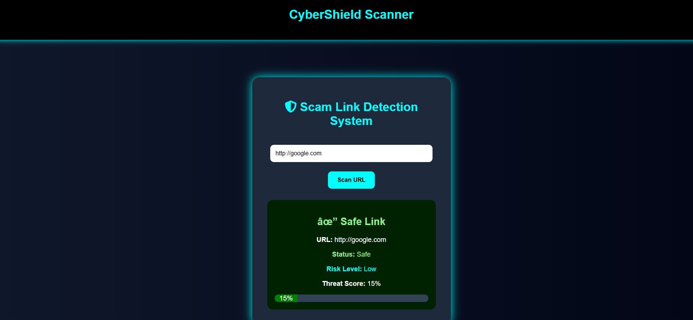
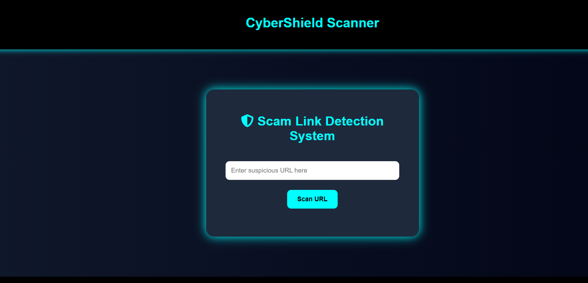
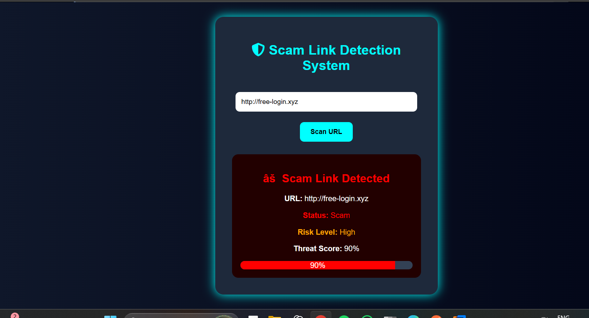

# Scam Link Detection System

## Overview
A full stack cybersecurity web application that detects suspicious and scam URLs using Java Spring Boot and JavaScript.

---

## Features
- URL scam detection
- Threat score analysis
- Cybersecurity themed UI
- REST API integration
- Full stack architecture

---

## Technologies Used
- Java
- Spring Boot
- HTML
- CSS
- JavaScript

---

## How To Run

1. Open project in IntelliJ
2. Run ScamdetectorApplication.java
3. Open:
   http://localhost:8080/index.html

---

## Future Enhancements
- AI-based scam detection
- VirusTotal API integration
- Real-time URL scanning
- Browser extension

---

## Author
Srushti SR
## Screenshots

### Home Page

### Scam Detection

### Safe Detection
